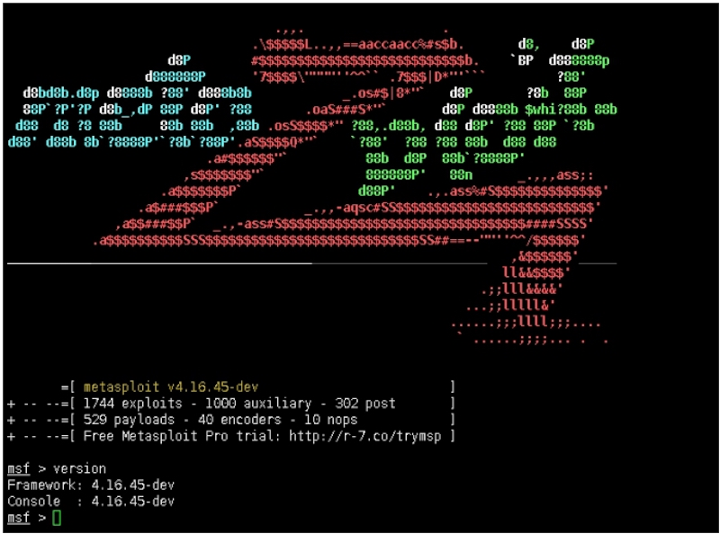

>   The world’s most used penetration testing framework.  
> 
>   Metasploit

从本季开始将会连载 Metasploit 教学，非常荣幸，本部门在我的“怂恿”下，基本以Metasploit 为常用框架做渗透。为了更好的把这个“坏习惯”延续下去，遂打算写一套完整的系列教程。以供同学们在使用中，或者新来的同学形成递归学习或者查询相关资料。在写的同时，查阅了大量的资料以及借鉴了许多思路。感谢为此贡献的老师们。

Metasploit 项目是一个旨在提供安全漏洞信息计算机安全项目，可以协助安全工程师进行渗透测试（penetration testing）及入侵检测系统签名开发。  
Github开源地址：https://github.com/rapid7/metasploit-framework

msf（未来Metasploit的简称）基本遵循PTES渗透测试标准。它将渗透分解如下：

1. 创建项目
2. 发现设备
3. 获取对主机的访问权限
4. 控制会话
5. 从目标主机收集证据
6. 会话清除
7. 生成报告（需pro版本）

### 而PTEST渗透测试标准如下：

1：前期交互阶段
在前期交互（Pre-Engagement Interaction）阶段，渗透测试团队与客户组织进行交互讨论，最重要的是确定渗透测试的范围、目标、限制条件以及服务合同细节。

该阶段通常涉及收集客户需求、准备测试计划、定义测试范围与边界、定义业务目标、项目管理与规划等活动。

2：情报收集阶段
在目标范围确定之后，将进入情报搜集（Information Gathering）阶段，渗透测试团队可以利用各种信息来源与搜集技术方法，尝试获取更多关于目标组织网络拓扑、系统配置
与安全防御措施的信息。

渗透测试者可以使用的情报搜集方法包括公开来源信息查询、Google Hacking、社会工程学、网络踩点、扫描探测、被动监听、服务查点等。而对目标系统的情报探查能力是渗透测试者一项非常重要的技能，情报搜集是否充分在很大程度上决定了渗透测试的成败，因为如果你遗漏关键的情报信息，你将可能在后面的阶段里一无所获。

3：威胁建模阶段
在搜集到充分的情报信息之后，渗透测试团队的成员们停下敲击键盘，大家聚到一起针对获取的信息进行威胁建模（Threat Modeling）与攻击规划。这是渗透测试过程中非常重要，但很容易被忽视的一个关键点。

通过团队共同的缜密情报分析与攻击思路头脑风暴，可以从大量的信息情报中理清头绪，确定出最可行的攻击通道。

4：漏洞分析阶段
在确定出最可行的攻击通道之后，接下来需要考虑该如何取得目标系统的访问控制权，即漏洞分析（Vulnerability Analysis）阶段。

在该阶段，渗透测试者需要综合分析前几个阶段获取并汇总的情报信息，特别是安全漏洞扫描结果、服务查点信息等，通过搜索可获取的渗透代码资源，找出可以实施渗透攻击的攻击点，并在实验环境中进行验证。在该阶段，高水平的渗透测试团队还会针对攻击通道上的一些关键系统与服务进行安全漏洞探测与挖掘，期望找出可被利用的未知安全漏洞，并开发出渗透代码，从而打开攻击通道上的关键路径。

5：渗透攻击阶段
渗透攻击（Exploitation）是渗透测试过程中最具有魅力的环节。在此环节中，渗透测试团队需要利用他们所找出的目标系统安全漏洞，来真正入侵系统当中，获得访问控制权。

渗透攻击可以利用公开渠道可获取的渗透代码，但一般在实际应用场景中，渗透测试者还需要充分地考虑目标系统特性来定制渗透攻击，并需要挫败目标网络与系统中实施的安全防御措施，才能成功达成渗透目的。在黑盒测试中，渗透测试者还需要考虑对目标系统检测机制的逃逸，从而避免造成目标组织安全响应团队的警觉和发现

6：后渗透攻击阶段
后渗透攻击（Post Exploitation）是整个渗透测试过程中最能够体现渗透测试团队创造力与技术能力的环节。前面的环节可以说都是在按部就班地完成非常普遍的目标，而在这个环节中，需要渗透测试团队根据目标组织的业务经营模式、保护资产形式与安全防御计划的不同特点，自主设计出攻击目标，识别关键基础设施，并寻找客户组织最具价值和尝试安全保护的信息和资产，最终达成能够对客户组织造成最重要业务影响的攻击途径。

在不同的渗透测试场景中，这些攻击目标与途径可能是千变万化的，而设置是否准确并且可行，也取决于团队自身的创新意识、知识范畴、实际经验和技术能力。

7：报告阶段
渗透测试过程最终向客户组织提交，取得认可并成功获得合同付款的就是一份渗透测试报告（Reporting）。这份报告凝聚了之前所有阶段之中渗透测试团队所获取的关键情报信息、探测和发掘出的系统安全漏洞、成功渗透攻击的过程，以及造成业务影响后果的攻击途径，同时还要站在防御者的角度上，帮助他们分析安全防御体系中的薄弱环节、存在的问题，以及修补与升级技术方案。

本系列教程以msf 4.15.45为基础，后期可能会以msf5为基础。  

msf核心代码为Ruby开发。这里需要解释，为什么作者以Ruby为核心语言开发？而不是python，perl等大众语言开发？

### 这里转载原作者的话：  

以下是在2005年左右写的。
在框架的开发过程中，Metasploit开发人员不断被问到的一个反复出现的问题是为什么选择Ruby作为编程语言。为避免单独回答此问题，作者选择在本文档中解释其原因。

由于很多原因，选择了Ruby编程语言而不是其他选择，例如python，perl和C++。选择Ruby的第一个（也是主要的）原因是因为它是Metasploit员工喜欢写的一种语言。在花时间分析其他语言并考虑过去的经验后，发现Ruby编程语言既简单又强大解释语言的方法。Ruby提供的内省程度和面向对象的方面非常适合框架的一些要求。框架对代码重用的自动化类构造的需求是决策制定过程中的关键因素，而且它是perl不太适合提供的东西之一。除此之外，选择Ruby的第二个原因是因为它支持平台独立于线程。虽然在该模型下开发框架期间遇到了许多限制，但Metasploit工作人员观察到了2.x分支的显着性能和可用性改进。未来版本的Ruby（1.9系列）将使用本机线程支持现有的线程API，操作系统将编译解释器，这将解决当前实现的许多现有问题（例如允许使用阻塞操作）。与此同时，与传统的分叉模型相比，现有的线程模型被发现要优越得多，特别是在缺少像Windows这样的原生分支实现的平台上。

选择Ruby的另一个原因是因为Windows平台支持存在本机解释器。虽然perl有cygwin版本和ActiveState版本，但两者都受到可用性问题的困扰。可以在Windows上本地编译和执行Ruby解释器的事实大大提高了性能。此外，解释器也非常小，并且可以在出现错误时轻松修改。

Python编程语言也是候选语言。Metasploit员工选择Ruby而不是python的原因有几个原因。主要原因是对python强制的一些语法烦恼的普遍厌恶，例如block-indention。虽然许多人认为这种方法的好处，但Metasploit工作人员的一些成员认为这是一个不必要的限制。Python的其他问题围绕父类方法调用的限制和解释器的向后兼容性。

 C / C++编程语言也得到了非常认真的考虑，但最终很明显，尝试以非解释性语言部署可移植和可用的框架是不可行的。

此外，这种语言选择的开发时间线很可能会更长。尽管框架的2.x分支已经相当成功，但Metasploit开发人员遇到了许多限制和烦恼与perl的面向对象编程模型或缺乏。事实上perl解释器是许多发行版上默认安装的一部分，这并不是Metasploit员工认为值得绕开语言选择的东西。

最后，所有这些都归结为选择一种对框架贡献最大的人所享有的语言，而这种语言最终成为Ruby。

>   Micropoor
