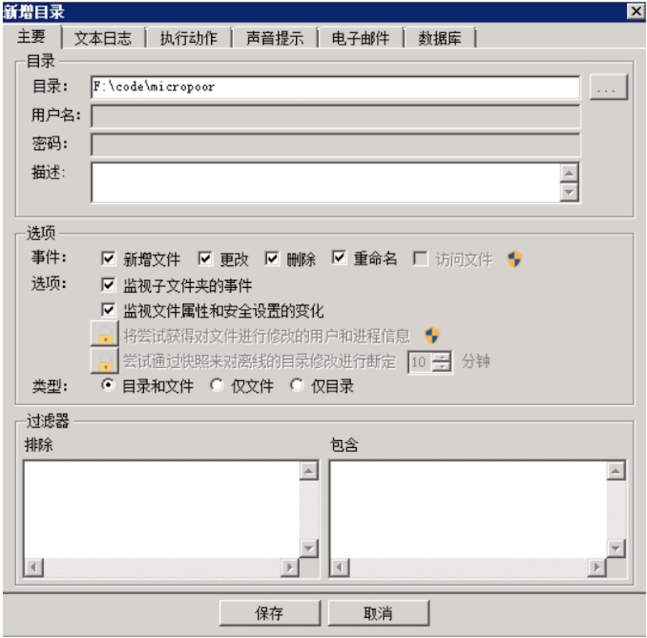
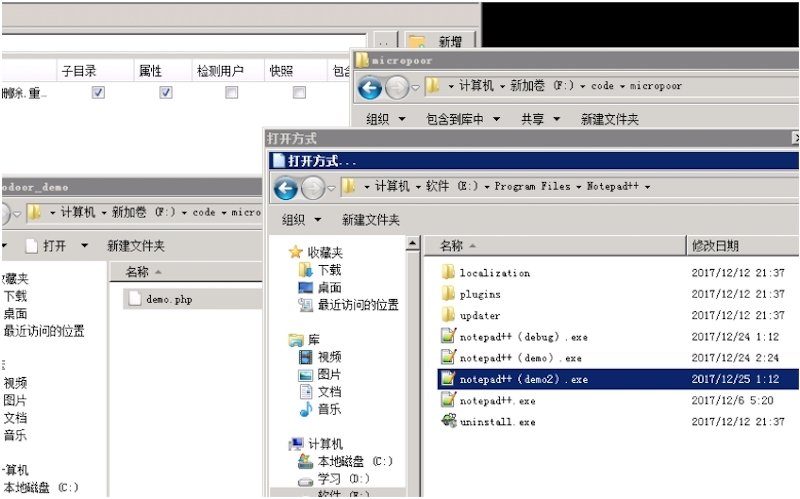
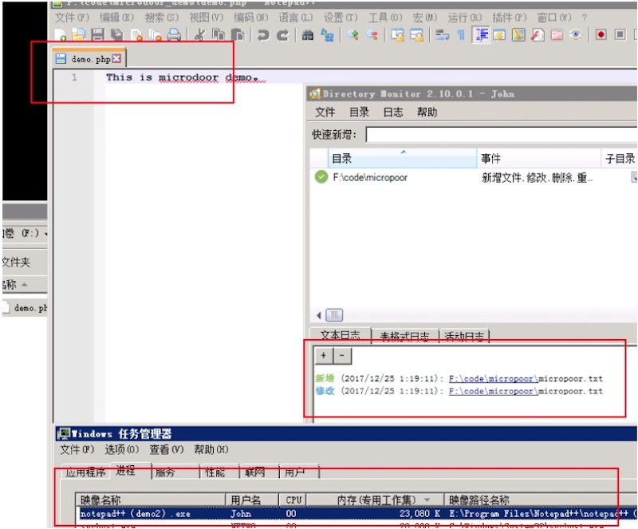
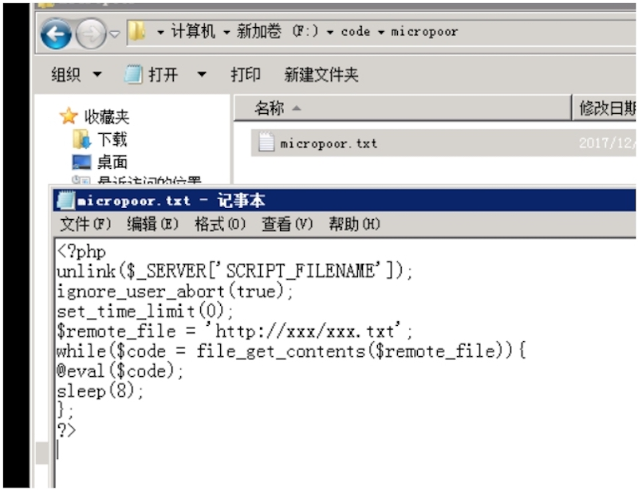

这次继续围绕第一篇，第一季关于后门：
https://micropoor.blogspot.hk/2017/12/php.html
做整理与补充。在深入一步细化demo notepad++。

后门是渗透测试的分水岭，它分别体现了攻击者对目标机器的熟知程度，环境，编程语言，了解对方客户，以及安全公司的本质概念。这样的后门才能更隐蔽，更长久。

而对于防御者需要掌握后门的基本查杀，与高难度查杀，了解被入侵环境，目标机器。以及后门或者病毒可隐藏角落，或样本取证，内存取证。

所以说后门的安装与反安装是一场考试，一场实战考试。

这里要引用几个概念，只有概念清晰，才能把后门加入概念化，使其更隐蔽。

**1：攻击方与防御方的本质是什么？**  
增加对方的时间成本，人力成本，资源成本（不限制于服务器资源），金钱成本。  

**2：安全公司的本质是什么？**
盈利，最小投入，最大产出。  

**3：安全公司产品的本质是什么？**
能适应大部分客户，适应市场化，并且适应大部分机器。（包括不限制于资源紧张，宽带不足等问题的客户）  

 **4：安全人员的本质是什么？**
赚钱，养家。买房，还房贷。导致，快速解决客户问题（无论暂时还是永久性解决），以免投诉。  

**5：对接客户的本质是什么？**
对接客户也是某公司内安全工作的一员，与概念4相同。

清晰了以上5个概念，作为攻击者，要首先考虑到对抗成本，什么样的对抗成本，能满足概念1-5。影响或阻碍对手方的核心利益。把概念加入到后门，更隐蔽，更长久。

文章的标题既然为php安全新闻早八点，那么文章的本质只做技术研究，Demo本身不具备攻击或者持续控制权限功能。

### Demo连载第二季：
Demo 环境：windows 7 x64，notepad++(x64) 
Demo IDE：vs2017

在源码中，我们依然修改每次打开以php结尾的文件，先触发后门，在打开文件。其他文件跳过触发后门。但是这次代码中加入了生成micropoor.txt功能。并且使用php来加载运行它，是的，生成一个txt。demo中，为了更好的演示，取消自动php加载运行该txt。
而txt的内容如图所示，并且为了更好的了解，开启文件监控。  

使用notepad++(demo2).exe 打开以php结尾的demo.php，来触发microdoor。并且生成了micropoor.txt  

  

而micropoor.txt内容：  

配合micropoor.txt的内容，这次的Demo将会变得更有趣。

**那么这次demo 做到了，无服务，无进程，无端口，无自启。
根据上面的5条概念，加入到了demo中，增加对手成本。使其更隐蔽。**

如果demo不是notepad++，而是mysql呢?用它的端口，它的进程，它的服务，它的一切，来重新编译microdoor。  

例如：重新编译mysql.so,mysql.dll，替换目标主机。  

无文件，无进程，无端口，无服务，无语言码。因为一切附属于它。  

这应该是一个攻击者值得思考的问题。

**正如第一季所说：在后门的进化中，rootkit也发生了变化，最大的改变是它的系统层次结构发生了变化。**

>   Micropoor
